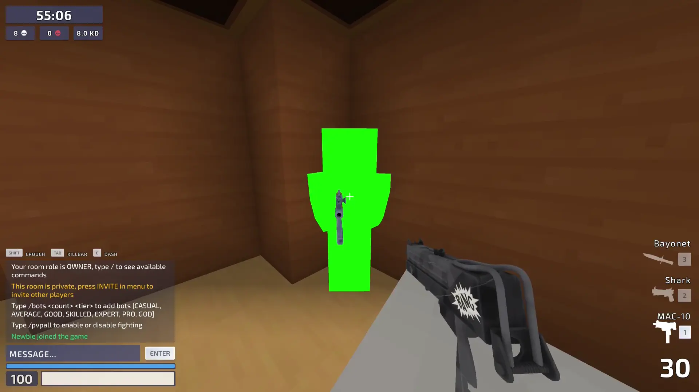
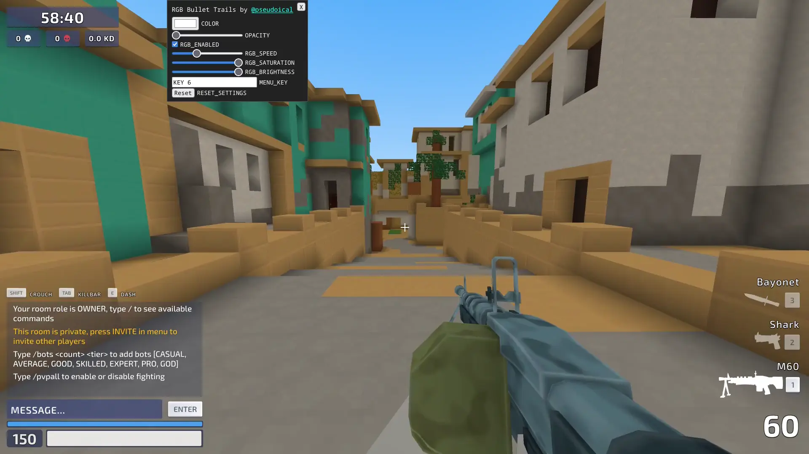

# Kirka Scripts

> [!CAUTION]
> Use at your own risk and abide by Kirka's [Terms of Use](https://kirka.io/hub/terms). I am not responsible for any consequences that may result from your actions with these scripts.

A collection of unofficial [Kirka.io](https://kirka.io/) scripts designed to enhance and customize gameplay.

If a script doesn't work, refresh the page and try again. For more help, message [@pseudoical](https://discord.com/users/1408292932624060426) on Discord.

# [Health Bar Mod](scripts/health-bar-mod.js) v1.0.0

Color players from green to red based on HP.

# [RGB Bullet Trails](scripts/rgb-bullet-trails.js) v1.0.0

Color bullet trails. Press `6` to open the menu.

# [Weapon Animator](scripts/weapon-animator.js) v2.0.0

Animate weapon skins. Press `5` to open the menu. Set all skins to their default textures. View a guide [here](guides/weapon-animator.md).

---

This project is licensed under the <a href="LICENSE">MIT License</a>.

