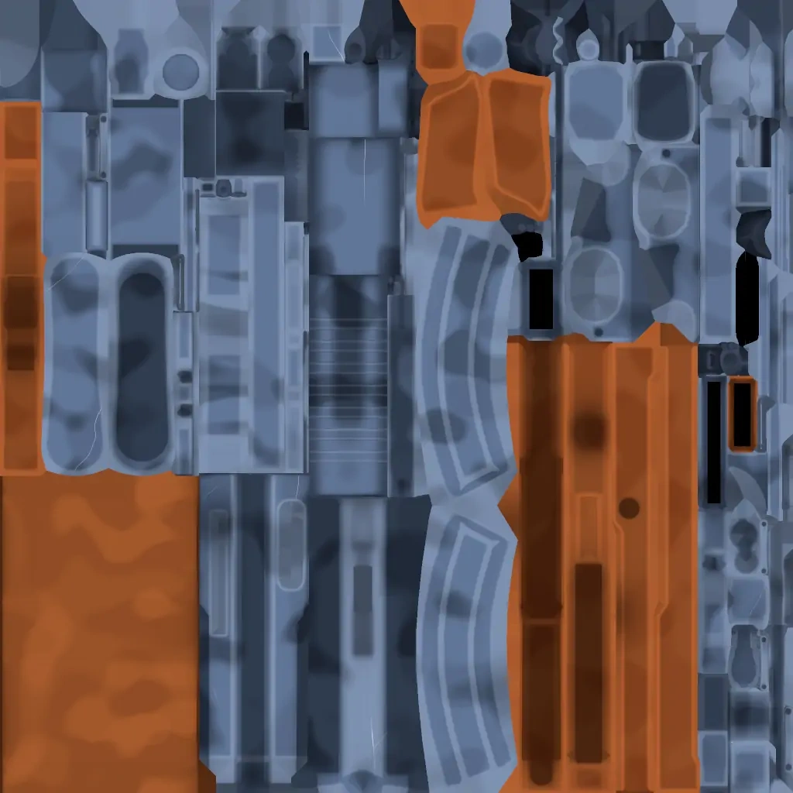
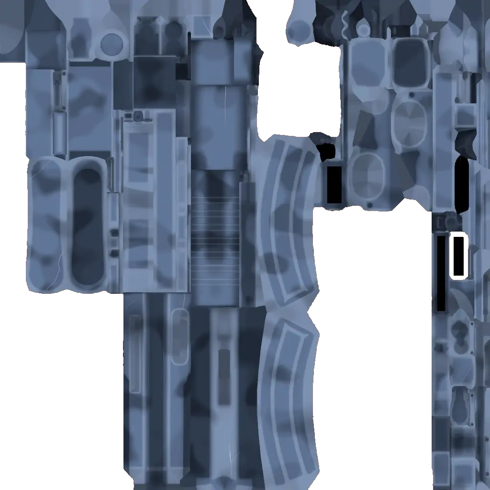
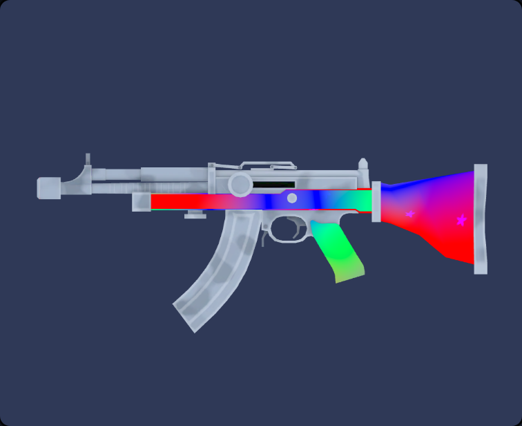
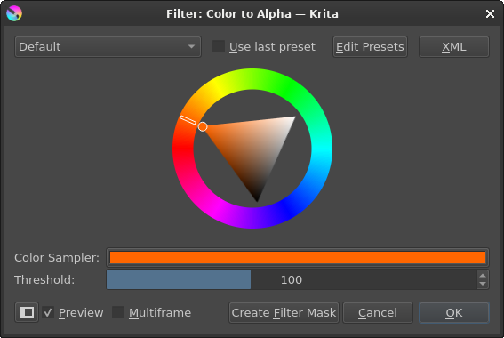

# Weapon Animator Guide

Browse a collection of pre-made texture masks and animation previews:

- https://pseudoical.github.io/weapon-animator-res/

Alternatively, the resources can be found here:

- https://github.com/pseudoical/weapon-animator-res

## Table of Contents

- [What to do if it's not working](#what-to-do-if-its-not-working)
- [What is a texture mask?](#what-is-a-texture-mask)
- [Set a texture mask](#set-a-texture-mask)
    - [With a Discord URL](#with-a-discord-url)
    - [With a data URL](#with-a-data-url)
- [Make a texture mask in Krita](#make-a-texture-mask-in-krita)
    - [Using the Similar Color Selection Tool](#using-the-similar-color-selection-tool)
    - [Using the Color to Alpha filter](#using-the-color-to-alpha-filter)
- [Get texture images](#get-texture-images)
    - [From the Discord server](#from-the-discord-server)
    - [From the Developer Tools](#from-the-developer-tools)

# What to do if it's not working

If you only see a custom skin with no animations, switch to the default texture. Animations only render on the default texture.

The script can sometimes be buggy, and animations may not render in the lobby. They should still work in the skin inspector and in-game. Refreshing the page usually fixes the issue.

For more help, message [@pseudoical](https://discord.com/users/1408292932624060426) on Discord.

# What is a texture mask?

| Regular Texture | Texture Mask | Result
|:---:|:---:|:---:|
|  |  | 

A texture mask is a regular texture image with varying levels of transparency. The remaining texture covers sections of the weapon that you don't want to be visible in the animation.

# Set a texture mask

A texture mask accepts only two types of URLs, due to the website's limitations. The first is a Discord URL, which is temporary and will eventually expire. The second is a data URL, which does not expire.

## With a Discord URL

1. Go to [assets/LAR_texture_mask.png](assets/LAR_texture_mask.png) and download the image.
2. Upload the image to a Discord server.
3. Click the image to open it.
4. Right-click the image and select **Copy Image Link**.
5. Paste the link into the `TEXTURE_MASK` textbox.

## With a data URL

1. Go to [assets/LAR_texture_mask.png](assets/LAR_texture_mask.png) and download the image.
2. Go to https://www.site24x7.com/tools/image-to-datauri.html.
3. Click **Browse** and select the image.
4. Copy the data URL generated on the right.
5. Paste the data URL into the `TEXTURE_MASK` textbox.

# Make a texture mask in Krita

The following guides assume that you have Krita installed and are familiar with its basic features.

## Using the Similar Color Selection Tool

1. Go to [assets/LAR_texture.png](assets/LAR_texture.png) and download the image.
2. Open the image in Krita.
3. On the left toolbar, click on the  icon.
4. Click a brown area on the image. Some brown areas may not be selected.
5. In that case, on the right toolbar, click the **Tool Options** tab, then adjust the threshold:  
    
6. Use the  tool again to select a brown area.
7. Repeat the process as needed until all of the brown areas are selected.
8. Right-click the image and select **Cut Selection to New Layer**.
9. Press the `Delete` key to remove the new layer.

See https://docs.krita.org/en/reference_manual/tools/similar_select.html for more information.

## Using the Color to Alpha filter

1. Go to [assets/LAR_texture.png](assets/LAR_texture.png) and download the image.
2. Open the image in Krita.
3. From the top menu, click **Filter**.
4. From the drop-down menu, hover over **Colors**.
5. Select **Color to Alpha...**.
6. Adjust the color wheel to a dark orange:  
    
7. If necessary, adjust the threshold.
8. Once most of the brown areas are transparent, click **OK**.

This method adjusts the transparency of selected colors rather than completely removing them. As a result, it may not produce as clean a cut as the [Using the Similar Color Selection Tool](#using-the-similar-color-selection-tool) method. It's best suited for textures with complex details that you want to preserve.

See https://docs.krita.org/sl/reference_manual/filters/colors.html for more information.

# Get texture images

## From the Discord server

1. In the Kirka Discord server, go to the `#bot-commands` channel.
2. Run the command: `/skin name: lar`.
3. Click **View Texture Image**.
4. Click the image to open it.
5. Right-click the image and select **Save Image As...**.

## From the Developer Tools

1. Go to the website or refresh the page.
2. Press `F12` to open DevTools.
3. At the top, click the **Network** tab.
4. Just below that, click **Img** or **Images**, depending on your browser.
5. Open global chat.
6. Send `[lava]` in chat and then click the message to view it.
7. The texture URL will appear in DevTools as "texture.12345.webp".
8. Hover over the texture URL and middle-click it to open it in a new tab.
9. Right-click the image and select **Save Image As...**.

This method is more involved than the [From the Discord server](#from-the-discord-server) method. Also, if the texture image has already been viewed, it will not appear in DevTools because it has already been cached. Because of this, it's best to use the first method.
